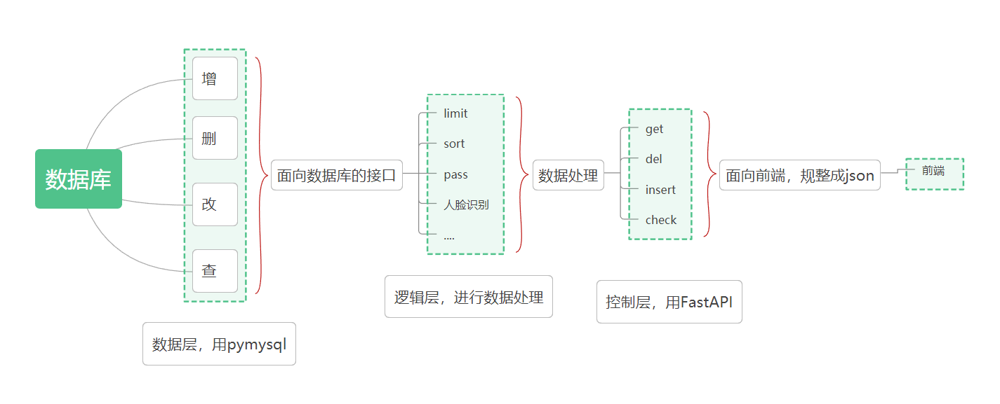

[TOC]

# rearend

> 暑假实训项目的后端部分。

## 功能实现



待讨论。

## 运行环境

> 仅列出主要安装的库。

```
# Name                    Version                   Build  Channel
python                    3.7.11               h6244533_0    defaults
aiofiles                  0.7.0                    pypi_0    pypi
fastapi                   0.68.0                   pypi_0    pypi
pymysql                   1.0.2                    pypi_0    pypi
uvicorn                   0.15.0                   pypi_0    pypi
```

## 开发者须知

### 文件存放

- `api`存放各功能模块需要调用的接口，即控制层。
- `assert`存放静态资源。
- `dao`存放与数据库有关的操作，即数据层。
- `service`存放与数据处理、行为逻辑有关的操作，即逻辑层。
- `model`存放自定义类等，即模型层。
- `img`存放readme中使用到的图片。

### 编码规范

- 使用pep8编码规范，vscode的话可以通过在`setting.json`文件中设置`"python.formatting.provider": "autopep8"`从而使默认的格式化文档风格为pep8，**写完代码后保持格式化文档一下的习惯**，下面说的是只靠格式化解决不了的问题。

- 引入第三方库别用`from ... import *`，用`import`或者要用啥引啥，比如`from PyQt5 import QWidget`，引用自己写的模块视情况而定。

以下三点均可以在编辑器中设置，修改可以参考https://www.cxyzjd.com/article/github_38851471/85268075（记得git的也要改，这是为了避免：https://github.com/cssmagic/blog/issues/22）。

- 使用 **4 空格缩进**，禁用任何 TAB 符号（编辑器或者idle可以设置自动将tab转成空格）。
- 源码文件使用 **UTF-8 无 BOM 编码格式（UTF-8）**。
- 总是使用 **Unix \n 风格换行符（LF）**。

- 在每一个 py 文件头，都添加如下内容：

```python
#!/usr/bin/env python
# -*- coding: utf-8 -*-
# 描述
```

下面两点的语法可参考：https://docs.python.org/zh-cn/3/library/typing.html

- 自定义函数要表明返回值类型（接口可以省了反正都是一样的）。

```python
def heihei(): -> None
    pass
def hah(): -> bool
    return True
```

- 函数参数需要注明类型

```python
def get_users(uname: str):
    return userService.getUserInfos(uname)
```

- 函数接口开始要写**注释**

```python
def hhh():
    r"""balabala
    """
    pass
```

- 代码块中的注释可写可不写，但尽量写块注释而不是行注释：

```python
# 我是块注释
pass
pass

pass # 我是行注释
```

- 文件和文件夹使用**小写单词**命名，多个单词之间用下划线连接：

```python
demo_module
demo_do_something.py
```

- 类名：（大驼峰原则）

每个单词的首字母大写，私有类以下划线开头，后面也是每个单词的首字母大写，多个单词拼接：

```python
class DemoClass():
	pass
class _PrivateClass():
	pass
```

- 函数名：

使用小写单词命名，多个单词之间用下划线连接，私有函数以下划线开头（继承父类来的比如`paintEvent`来的就没办法了）：

```python
def demo_function():
	pass
def _private_function():
	pass
```

- 变量名：

使用小写单词命名，多个单词之间用下划线连接：

```python
demo_variable = "Hello Python"
```

- 常量：
  使用大写单词命名，多个单词之间用下划线连接：

```python
DEMO_CONSTANT = 100
```

### Github上传规则

多人协作的工作模式通常是这样：

1. 首先，可以试图用`git push origin <branch-name>`推送自己的修改；
2. 如果推送失败，则因为远程分支比你的本地更新，需要先用`git pull`试图合并；
3. 如果合并有冲突，则解决冲突，并在本地提交；
4. 没有冲突或者解决掉冲突后，再用`git push origin <branch-name>`推送就能成功！

如果`git pull`提示`no tracking information`，则说明本地分支和远程分支的链接关系没有创建，用命令`git branch --set-upstream-to <branch-name> origin/<branch-name>`。

详见：https://www.liaoxuefeng.com/wiki/896043488029600/900375748016320

如果你不想你的工作被别人的push打扰，可以自己开一个分支，比如`git branch lxh`在上面提交，然后之后再将`lxh`和`main`合并。

