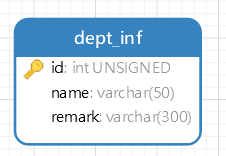
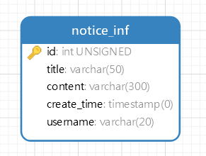
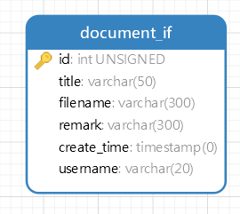

> 每个功能模块前面的图是其所用到的数据库，目前还比较粗糙，比较详细的要等代码完成后。

先不考虑鉴权安全那些。

# 增删查改

## 用户增删查改

### 添加用户

**请求方法**

POST

**输入参数**

- 必填项

username, passwd, status, department, job, name, card_id, phone, sex, party, birthday, race

- 选填项

  数据库user_inf属性中除id和create_date外均为选填项如remark，hobby等，默认值均为null

**返回值**

返回成功信息

### 删除用户

**请求方法**

DELETE

**输入参数**

- 必填项

username

- 选填项

  无

**返回值**

返回成功信息

### 查找用户

#### 普通用户接口

**请求方法**

GET

**输入参数**

- 必填项

- 选填项

  username, name,department, job, sex, limit=10, skip=0，其余默认值为null

**返回值**

一个列表，其中每个元素包括数据库除了id，password, status等敏感信息外的信息

#### 管理员用户接口

**管理员可以查到全部信息**

### 修改用户信息

> 密码不可以在这修改

**请求方法**

PUT

**输入参数**

- 必填项

  username

- 选填项

  除username，id，status，passwd外的其他都是，改什么传什么

**返回值**

返回成功信息

## 部门增删查改

### 添加部门

**请求方法**

POST

**输入参数**

- 必填项

  name

- 选填项

  remark

**返回值**

返回成功信息

### 删除部门

**请求方法**

DELETE

**输入参数**

- 必填项

  name

- 选填项

  无

**返回值**

返回成功信息

### 查找部门

**请求方法**

GET

**输入参数**

- 必填项

  name

- 选填项

  无

**返回值**

name，remark

### 修改部门信息

> 可以改名

**请求方法**

PUT

**输入参数**

- 必填项

  name

- 选填项

  remark

**返回值**

返回成功信息

## 职位增删查改

### 添加职位

**请求方法**

POST

**输入参数**

- 必填项

  name

- 选填项

  remark

**返回值**

返回成功信息

### 删除职位

**请求方法**

DELETE

**输入参数**

- 必填项

  name

- 选填项

  无

**返回值**

返回成功信息

### 查找职位

**请求方法**

GET

**输入参数**

- 必填项

  name

- 选填项

  无

**返回值**

name，remark

### 修改职位信息

> 可以改名

**请求方法**

PUT

**输入参数**

- 必填项

  name

- 选填项

  remark

**返回值**

返回成功信息

## 公告增删查改

### 添加公告

**请求方法**

POST

**输入参数**

- 必填项

  title, username 

- 选填项

  content

**返回值**

create_time，用来显示

### 删除公告

**请求方法**

DELETE

**输入参数**

- 必填项

  title

- 选填项

  无

**返回值**

返回成功信息

### 查找公告

**请求方法**

GET

**输入参数**

- 必填项

  无

- 选填项

  username，title，limit=10, skip=0，其余默认值为null

**返回值**

一个列表，里面每个包括username, content, title, create_time

### 修改公告信息

> 可以改名

**请求方法**

PUT

**输入参数**

- 必填项

  title

- 选填项

  content

**返回值**

返回成功信息

## 下载中心增删查改

### 上传文件

**请求方法**

POST

**输入参数**

- 必填项

  title, filename，username

- 选填项

  remark

**返回值**

create_time，用来显示

### 下载文件

**请求方法**

GET

**输入参数**

- 必填项

  title，filename

- 选填项

  无

**返回值**

文件

### 删除文件

**请求方法**

DELETE

**输入参数**

- 必填项

  title，filename

- 选填项

  无

**返回值**

返回成功信息

### 查找文件

**请求方法**

GET

**输入参数**

- 必填项

  无

- 选填项

  filename，username，title，create_time

**返回值**

一个列表，里面每个包括filename, username, title, create_time, remark

### 修改文件信息

> 可以改名

**请求方法**

PUT

**输入参数**

- 必填项

  title，username（创建者或者管理员才能改）

- 选填项

  remark，filename，title

**返回值**

返回成功信息

### 重新上传文件

调用删除文件加上传文件。

# 用户登录

## 密码

> 这个感觉要考虑加密哈啊，前端生成hd5码之类的再传过来。

### 修改密码

> 密码最少6位，最多32位。

**请求方法**

PUT

**输入参数**

- 必填项

  username，old_passwd，new_passwd

- 选填项

  无

**返回值**

返回成功信息

### 密码登录

密码验证后返回登录信息

**请求方法**

POST

**输入参数**

- 必填项

  username，passwd

- 选填项

  无

**返回值**

返回成功信息

## 人脸识别验证

> 这里可能要根据百度API来改，实在不行就做成本地的

### 人脸核验

### 核验登录

